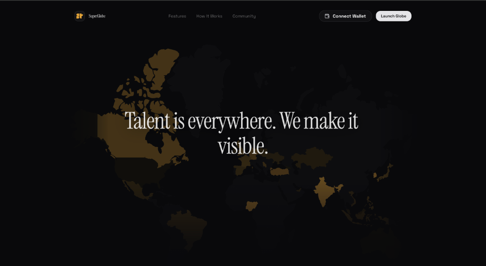
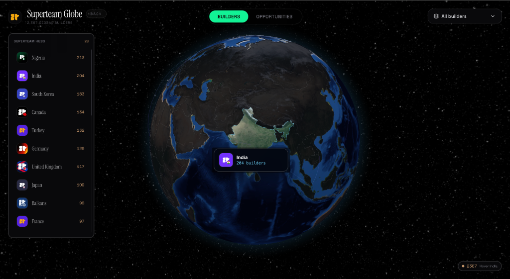
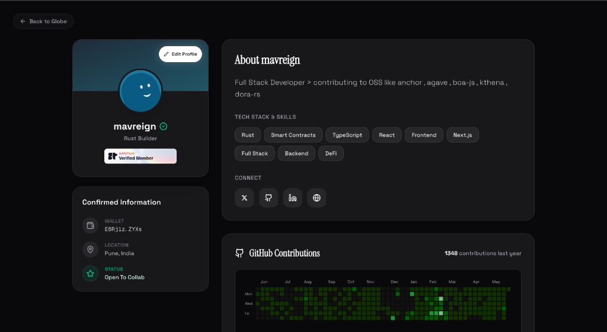
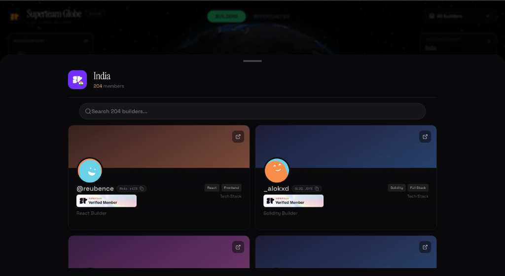
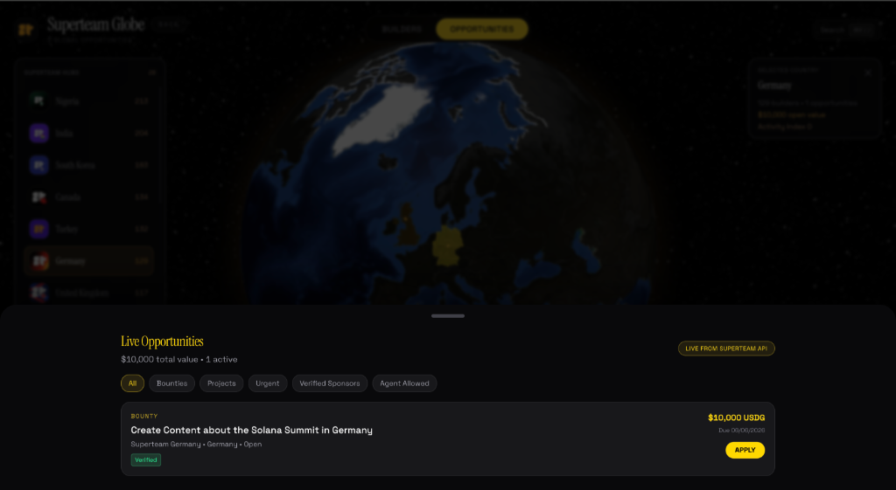

# Superteam Globe

Superteam Globe is a platform that visualizes the global network of Solana builders and opportunities. It provides a real-time, interactive 3D map that lets anyone discover where talent is clustered, view live bounties, and connect directly with verified ecosystem contributors.

## Core Features

### Interactive 3D Globe
The core of the application is a fully interactive 3D globe built with WebGL. It plots members and hubs across the world, allowing you to spin, zoom, and explore different regions. The globe has two main views:
* Builders View: See the density of Solana developers in various countries.
* Opportunities View: View active bounties, grants, and jobs mapped by region.

### Builder Profiles and Verification
Every builder gets a dedicated profile page. 
* Superteam Verified Badges: Recognized contributors have a verified badge to distinguish their profiles.
* Wallet Authentication: Builders connect and claim their profiles securely using their Solana wallets.
* Confirmed Information: See the builder's verified location, current status, and tech stack tags like Rust, React, and Smart Contracts.

### GitHub Integration
Profiles pull data directly from GitHub to show a developer's true activity.
* Contribution Heatmap: A familiar green square heatmap displays the builder's commit history for the last year.
* Top Repositories: Automatically showcases the open source projects the builder contributes to the most.

### Live Opportunities Hub
The platform pulls data directly from the Superteam API to display live earning opportunities.
* Filter by bounties, projects, urgent tasks, or verified sponsors.
* See the total dollar value of open opportunities in any specific country.
* Apply directly from the dashboard.

### Advanced Search and Filtering
The dashboard features a robust search and filter system.
* Country Sidebar: Browse a ranked list of countries by builder count, with quick navigation to specific regions.
* Members Drawer: When you click on a country, a sliding drawer reveals all the builders in that region.
* Search Bar: Instantly search for builders by name or handle within a selected country.

## Architecture and Stack

The project is built on a modern React stack optimized for performance and visual fidelity.

* Next.js App Router for routing and server side rendering.
* Tailwind CSS for styling and layout.
* Prisma ORM for database management and profile storage.
* React Three Fiber and Three.js for the 3D globe visualization.
* Framer Motion for page transitions and micro-interactions.
* NextAuth for session management and wallet authentication.

## Local Development

To run the project locally, install the dependencies and set up your environment variables.

1. Clone the repository
2. Install packages using npm install
3. Copy the example environment file to .env and fill in your database credentials
4. Run prisma db push to sync the database schema
5. Start the development server with npm run dev

The application will be available on localhost at port 3000.
